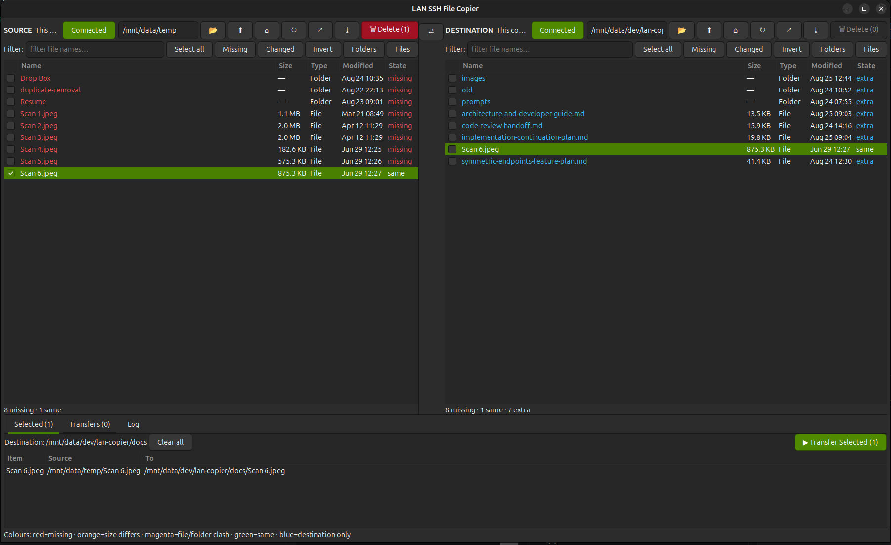
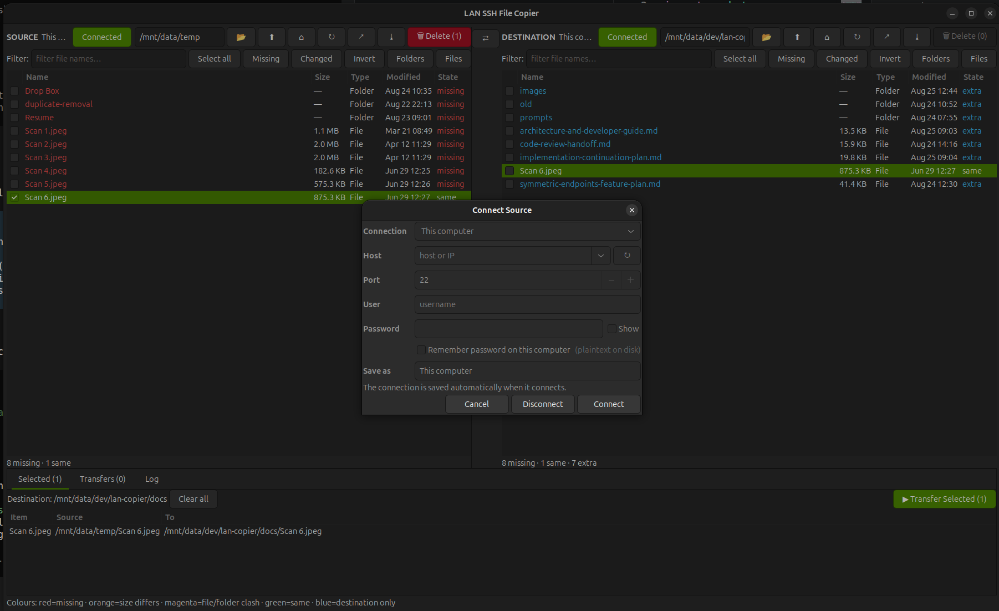

# Lan Copier

A lightweight GTK 3 desktop app for comparing, transferring, and managing files
between local and remote (SSH) machines on a LAN.

## Features

- **Symmetric endpoints** — any side can be source or destination (local, SSH Linux/macOS, SSH Windows via PowerShell)
- **Dual-pane browser** — side-by-side file trees with live comparison (missing / changed / same / extra / conflict)
- **Parallel transfers** — 1–8 concurrent transfers with progress, pause, resume, cancel
- **Conflict resolution** — Ask (smart), Overwrite, Keep both, Skip
- **Safe deletion** — checked-item-only deletion with protected-path guards, symlink safety, and NTFS resilience
- **LAN discovery** — auto-scan subnet for SSH hosts
- **Tree export** — YAML snapshot of any source/destination tree
- **Side swap** — flip source and destination in one click

## Screenshots

## Requirements

- Python 3.6+
- GTK 3.0 + PyGObject (`gi.repository`)
- OpenSSH (`ssh`, `scp`, `ssh-keygen`) in `$PATH`
- Linux, macOS, or Windows (with OpenSSH + bundled `tar.exe`)

## Installation

    git clone https://github.com/<you>/lan-copier.git
    cd lan-copier
    python3 main.py

No `pip install` — zero third-party Python dependencies.

## Usage

    python3 main.py

1. Click **Connect** on either side to pick "This computer" or an SSH endpoint
2. Browse and check files to transfer
3. Hit **Copy** or **Move**

## Project Structure

    main.py                 Entry point
    app/
      window.py             Main window (AppWindow)
      profiles.py           Saved SSH profiles
      widgets/
        endpoint.py         EndpointBar (connect, path, actions)
        dirpane.py          Dual-pane file tree with comparison
        dialog.py           Connection dialog (SSH discovery, login)
    ssh_transport.py        SSH connection + OpenSSH multiplexing
    local_transport.py      Local filesystem operations
    transfer_engine.py      Parallel copy/move engine
    tree_exporter.py        YAML tree snapshot exporter
    discovery.py            LAN subnet scanner
    commands/               Remote command builders (POSIX, PowerShell)
    tests/                  Test suite (one file per module)
    docs/                   Architecture docs and developer guides

## Testing

    python3 tests.py

## License

MIT
